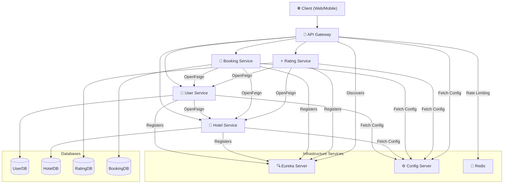
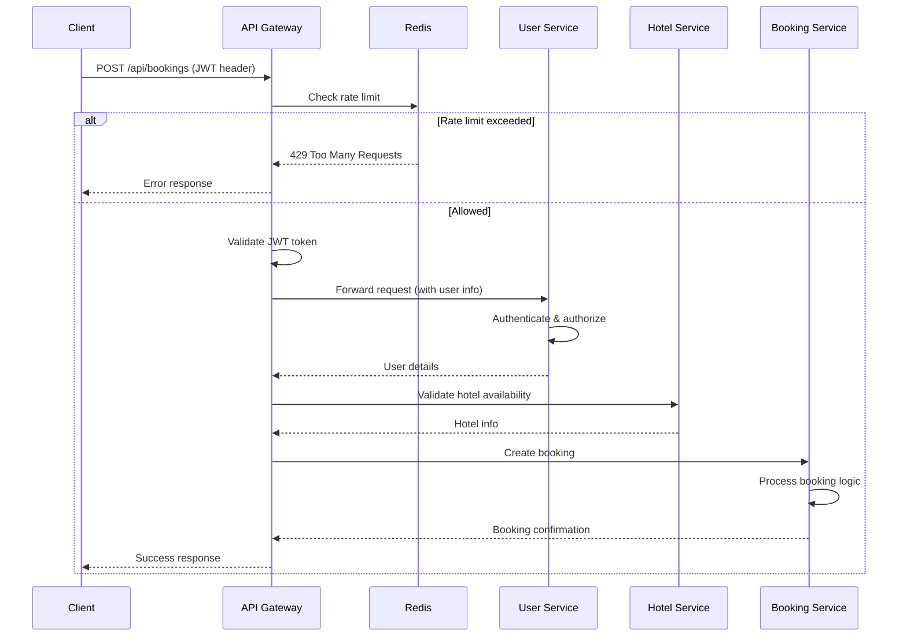
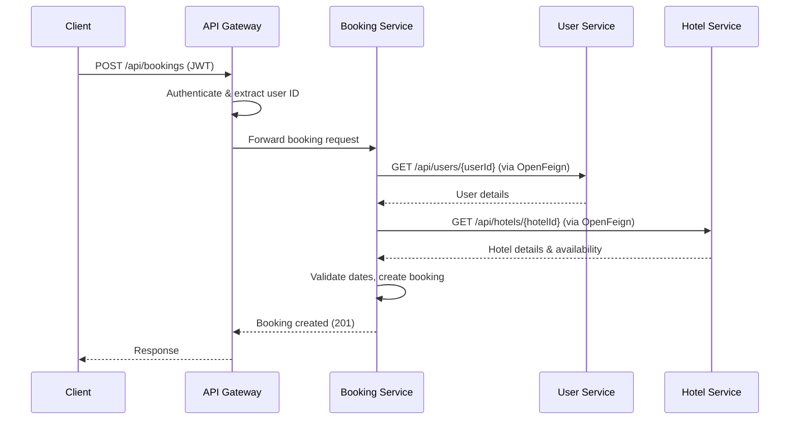
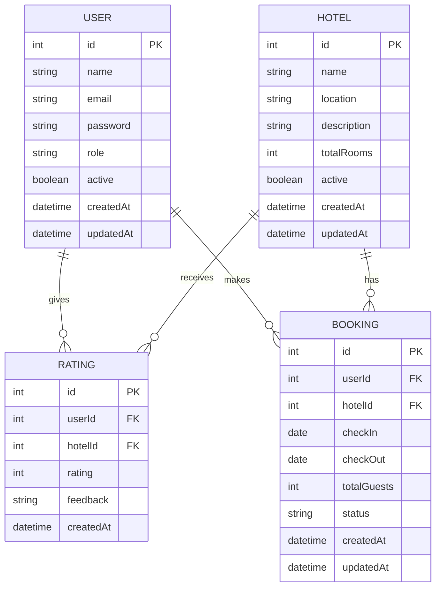

# 🏨 Hotel Booking Microservices Platform

[](LICENSE)
[](https://www.oracle.com/java/)
[](https://spring.io/projects/spring-boot)
[](https://spring.io/projects/spring-cloud)

A **production-oriented** hotel booking platform built with **Spring Boot Microservices**, following **Domain-Driven Design (DDD)** principles. It demonstrates a scalable microservice architecture with service discovery, centralized configuration, API Gateway, JWT authentication, role-based access control, fault tolerance, and secure inter-service communication.

---

## 📑 Table of Contents

- [Overview](#-overview)
- [Key Features](#-key-features)
- [System Architecture](#-system-architecture)
- [Microservices Breakdown](#-microservices-breakdown)
- [Application Flow & Sequence Diagrams](#-application-flow--sequence-diagrams)
- [Technology Stack](#-technology-stack)
- [Project Structure](#-project-structure)
- [Security Design](#-security-design)
- [Fault Tolerance & Resilience](#-fault-tolerance--resilience)
- [Database Design](#-database-design)
- [Getting Started](#-getting-started)
- [Configuration](#-configuration)
- [API Documentation](#-api-documentation)
- [Key Highlights](#-key-highlights)
- [Author](#-author)

---

## 📖 Overview

The **Hotel Booking Microservices Platform** is a modular backend system that simulates a real-world hotel booking workflow. Each business capability is encapsulated in its own microservice with an independent database, communication via REST APIs, and robust infrastructure components such as Eureka, Config Server, and API Gateway. The platform is built with clean code principles, DDD, and industry best practices.

---

## ✨ Key Features

- ✅ **Microservices Architecture** – Loosely coupled, independently deployable services.
- 🧩 **Domain-Driven Design** – Clear separation of business domains (User, Hotel, Rating, Booking).
- 🔍 **Service Discovery** – Eureka server for dynamic registration and load balancing.
- 🚪 **API Gateway** – Single entry point with routing, authentication, rate limiting, and logging.
- 🔐 **JWT Authentication** – Stateless token-based authentication with RBAC.
- 🔒 **Secure Inter-Service Communication** – JWT propagation via OpenFeign interceptors.
- 🛡️ **Fault Tolerance** – Resilience4j circuit breaker and retry mechanisms.
- ⚡ **Redis Rate Limiting** – Prevent API abuse and ensure stability.
- ⚙️ **Centralized Configuration** – Spring Cloud Config Server for environment-specific properties.
- 📄 **RESTful APIs** – Pagination, sorting, filtering, validation, and standard response structure.
- 🗄️ **Independent Databases** – Each microservice owns its data (MySQL).
- 🌐 **Global Exception Handling** – Consistent error responses across services.

---

## 🏗️ System Architecture

The following diagram illustrates the high-level components and their interactions:



---

## 🧩 Microservices Breakdown

| Service | Responsibilities | Key Endpoints |
|---------|------------------|---------------|
| **User Service** | Registration, login, user management, JWT generation, role assignment | `/api/users`, `/api/auth/login`, `/api/auth/register` |
| **Hotel Service** | Hotel CRUD, search, details management | `/api/hotels` |
| **Rating Service** | Ratings, reviews, average rating calculation | `/api/ratings` |
| **Booking Service** | Room booking, status management, booking history, workflow | `/api/bookings` |
| **API Gateway** | Single entry point, JWT validation, routing, global filters, logging, Redis rate limiting | `/api/**` |
| **Eureka Server** | Service registration and discovery | `/eureka` |
| **Config Server** | Centralized configuration management | `/config` |

---

## 🔄 Application Flow & Sequence Diagrams

### 🚀 Typical Request Flow



### 📝 Booking Creation Flow (Detailed)



---

## 🛠️ Technology Stack

| Category           | Technology        | Usage                                  |
|-------------------|-------------------|----------------------------------------|
| Language          | Java              | Core programming language              |
| Framework         | Spring Boot       | Microservices development              |
| Security          | Spring Security   | Authentication & Authorization         |
| API Gateway       | Spring Cloud Gateway | Routing, filtering, rate limiting   |
| Service Discovery | Netflix Eureka    | Registration and discovery             |
| Config Server     | Spring Cloud Config| Centralized configuration              |
| Inter-Service Com | OpenFeign         | Declarative REST clients               |
| Fault Tolerance   | Resilience4j      | Circuit breaker, retry                 |
| Persistence       | Spring Data JPA   | Repository abstraction                 |
| ORM               | Hibernate         | Object-relational mapping              |
| Database          | MySQL             | Primary data store                     |
| Cache / Rate Limit| Redis             | Rate limiting, caching                 |
| Authentication    | JWT (jjwt)        | Token generation and validation        |
| Build Tool        | Maven             | Dependency management                  |
| Version Control   | Git               | Source code management                 |
| API Testing       | Postman           | Manual endpoint testing                |

---

## 📁 Project Structure

```
hotel-booking-microservices/
│
├── api-gateway/               # Spring Cloud Gateway application
├── config-server/             # Spring Cloud Config Server
├── eureka-server/             # Netflix Eureka Server
├── user-service/              # User domain microservice
├── hotel-service/             # Hotel domain microservice
├── rating-service/            # Rating domain microservice
├── booking-service/           # Booking domain microservice
│
├── .gitignore
├── LICENSE
└── README.md
```

---

## 🔐 Security Design

- **JWT Authentication**: Stateless tokens issued by the User Service during login.
- **Role-Based Access Control (RBAC)**: Roles like `USER`, `ADMIN`, `HOTEL_MANAGER` are embedded in the JWT and enforced via Spring Security annotations.
- **API Gateway Security**: The gateway validates JWT on every request and forwards the token to downstream services.
- **Secure Inter-Service Communication**: Each service includes a Feign interceptor that propagates the `Authorization` header automatically.
- **Password Hashing**: BCrypt password encoder for secure storage.
- **CORS Configuration**: Properly configured for cross-origin requests (if needed).

---

## 🛡️ Fault Tolerance & Resilience

Implemented with **Resilience4j**:

- **Circuit Breaker**: Prevents cascading failures when a downstream service is down.
- **Retry**: Automatically retries failed requests a configurable number of times with backoff.
- **Fallback Methods**: Graceful degradation with user-friendly error responses.
- **Time Limiter**: Ensures requests do not hang indefinitely.

Example configuration (in `application.yml`):
```yaml
resilience4j:
  circuitbreaker:
    instances:
      hotelService:
        registerHealthIndicator: true
        slidingWindowSize: 10
        minimumNumberOfCalls: 5
        failureRateThreshold: 50
        waitDurationInOpenState: 10s
  retry:
    instances:
      hotelService:
        maxAttempts: 3
        waitDuration: 2s
```

---

## 🗄️ Database Design

Each microservice has its own MySQL database to ensure **loose coupling** and **isolation**. Below is a simplified ER model:



---

## ▶️ Getting Started

### Prerequisites

- JDK 17+
- Maven 3.9+
- MySQL 8+
- Redis 6+
- Git

### Clone Repository

```bash
git clone https://github.com/your-username/hotel-booking-microservices.git
cd hotel-booking-microservices
```

### Build All Services

```bash
mvn clean install
```

### Start Services (Order Matters)

1. **Config Server** – Port `8888`
2. **Eureka Server** – Port `8761`
3. **Redis** – Default port `6379` (external)
4. **API Gateway** – Port `8080`
5. **User Service** – Port `8081`
6. **Hotel Service** – Port `8082`
7. **Rating Service** – Port `8083`
8. **Booking Service** – Port `8084`

Each service can be started with:
```bash
cd <service-name>
mvn spring-boot:run
```

### Verify Services

- Eureka Dashboard: `http://localhost:8761`
- API Gateway Health: `http://localhost:8080/actuator/health`
- Config Server: `http://localhost:8888/user-service/default`

---

## ⚙️ Configuration

All services fetch their configuration from the **Config Server**. Configuration files are stored in a Git repository (or local filesystem) and contain environment-specific properties.

Sample `user-service.properties`:
```properties
server.port=8081
spring.datasource.url=jdbc:mysql://localhost:3306/userdb
spring.datasource.username=root
spring.datasource.password=secret
eureka.client.service-url.defaultZone=http://localhost:8761/eureka
jwt.secret=mySuperSecretKey
```

For **rate limiting**, Redis connection details are configured in the API Gateway:
```yaml
spring:
  data:
    redis:
      host: localhost
      port: 6379
```

---

## 📚 API Documentation

The platform does not currently include Swagger/OpenAPI, but endpoints can be tested using Postman. Below is a sample of key endpoints:

### User Service
| Method | Endpoint | Description |
|--------|----------|-------------|
| POST | `/api/auth/register` | Register new user |
| POST | `/api/auth/login` | Authenticate and get JWT |
| GET | `/api/users/{id}` | Get user by ID (Admin/User) |
| PUT | `/api/users/{id}` | Update user |
| DELETE | `/api/users/{id}` | Soft delete user |

### Hotel Service
| Method | Endpoint | Description |
|--------|----------|-------------|
| GET | `/api/hotels` | List hotels (pagination, filter) |
| POST | `/api/hotels` | Create hotel (Admin) |
| GET | `/api/hotels/{id}` | Get hotel details |
| PUT | `/api/hotels/{id}` | Update hotel |
| DELETE | `/api/hotels/{id}` | Soft delete hotel |

### Booking Service
| Method | Endpoint | Description |
|--------|----------|-------------|
| POST | `/api/bookings` | Create booking |
| GET | `/api/bookings/user/{userId}` | Get user's bookings |
| GET | `/api/bookings/{id}` | Get booking by ID |
| PATCH | `/api/bookings/{id}/cancel` | Cancel booking |

> **Note**: All protected endpoints require `Authorization: Bearer <JWT>` header.

---

## 🔥 Key Highlights

- 🏭 **Production-Ready Architecture**
- 🔐 **Secure JWT Authentication & RBAC**
- 📡 **Service Discovery with Eureka**
- 🚪 **API Gateway with Rate Limiting (Redis)**
- ⚡ **Fault Tolerance via Resilience4j**
- 🧩 **Independent Databases per Service**
- 🔄 **OpenFeign Inter-Service Communication**
- 🧪 **Consistent Error Handling & Validation**
- 🚀 **Easily Scalable and Maintainable**

---

## 👨‍💻 Author

**Abhishek Kanade**

*Java Backend Developer | Spring Boot | Microservices | Spring Security | REST APIs*

📧 Email: [abhishek.kanade@example.com](mailto:abhishek.kanade@example.com)  
💼 LinkedIn: [linkedin.com/in/abhishekkanade](https://linkedin.com/in/abhishekkanade)  
🐙 GitHub: [github.com/abhishekkanade](https://github.com/abhishekkanade)

---

<div align="center">
  <sub>Built with ❤️ using Spring Boot and best practices.</sub>
</div>
